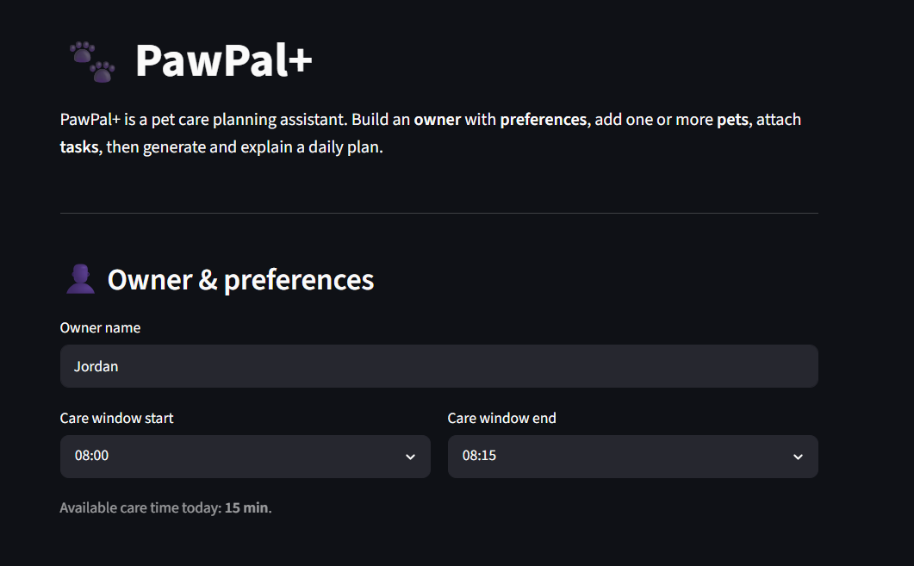
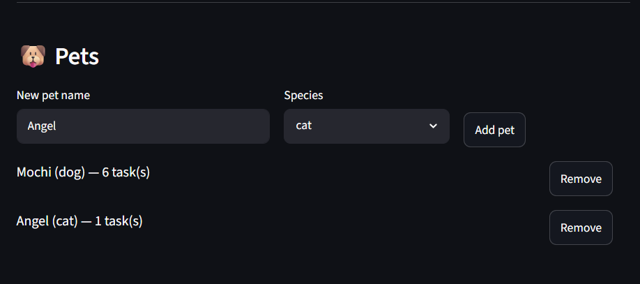
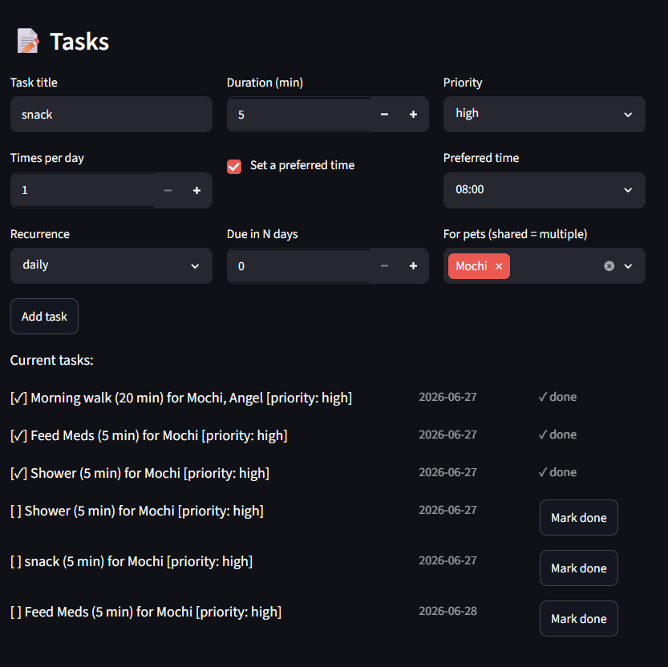
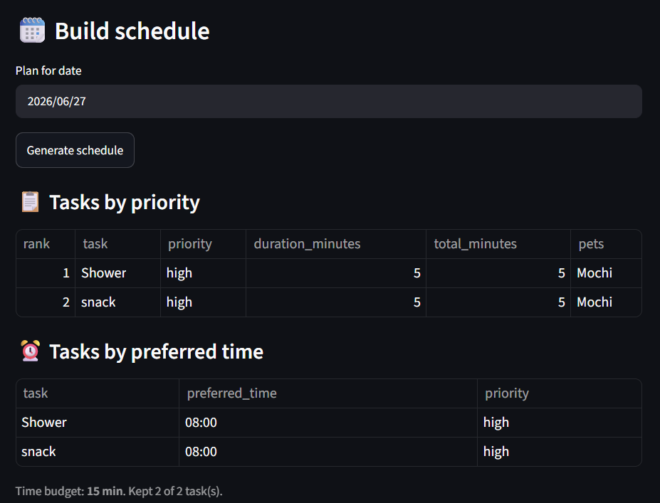
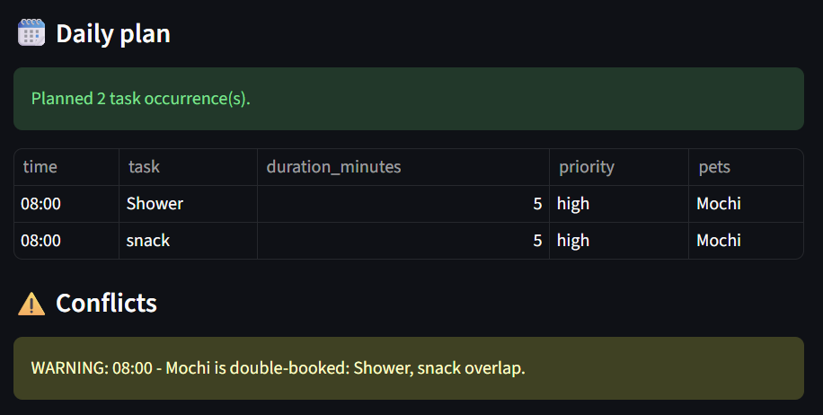

# PawPal+ (Module 2 Project)

You are building **PawPal+**, a Streamlit app that helps a pet owner plan care tasks for their pet.

## Scenario

A busy pet owner needs help staying consistent with pet care. They want an assistant that can:

- Track pet care tasks (walks, feeding, meds, enrichment, grooming, etc.)
- Consider constraints (time available, priority, owner preferences)
- Produce a daily plan and explain why it chose that plan

Your job is to design the system first (UML), then implement the logic in Python, then connect it to the Streamlit UI.

## What you will build

Your final app should:

- Let a user enter basic owner + pet info
- Let a user add/edit tasks (duration + priority at minimum)
- Generate a daily schedule/plan based on constraints and priorities
- Display the plan clearly (and ideally explain the reasoning)
- Include tests for the most important scheduling behaviors

## Getting started

### Setup

```bash
python -m venv .venv
source .venv/bin/activate  # Windows: .venv\Scripts\activate
pip install -r requirements.txt
```

### Suggested workflow

1. Read the scenario carefully and identify requirements and edge cases.
2. Draft a UML diagram (classes, attributes, methods, relationships).
3. Convert UML into Python class stubs (no logic yet).
4. Implement scheduling logic in small increments.
5. Add tests to verify key behaviors.
6. Connect your logic to the Streamlit UI in `app.py`.
7. Refine UML so it matches what you actually built.

## 🖥️ Sample Output

Paste a sample of your app's CLI or Streamlit output here so a reader can see what a generated plan looks like:

```
# e.g.:
Today's Schedule for Sam (Friday, June 26, 2026)
  08:00 Morning walk: 30 min, task priority:high, Pets: Biscuit
  09:00 Feeding: 10 min, task priority:high, Pets: Biscuit, Snow
  18:00 Dog meds: 5 min, task priority:medium, Pets: Biscuit
#   ...
```

## 🧪 Testing PawPal+

The tests cover the core behaviors including task completion, generating recurring tasks, sorting the tasks by priority and time, and detecting task conflicts.

Confidence Level: 5 stars. The system is reliable because all 13 tests passed.

```bash
# Run the full test suite:
python -m pytest

# Run with coverage:
python -m pytest --cov
```

Sample test output:

```
========================================================================================== test session starts ==========================================================================================
platform win32 -- Python 3.13.13, pytest-9.1.1, pluggy-1.6.0
rootdir: C:\Users\User\Desktop\2026\Codepath\AI110\week_4\ai110-module2show-pawpal-starter
plugins: anyio-4.14.0
collected 13 items                                                                                                                                                                                       

test\test_pawpal.py .............                                                                                                                                                                  [100%]

========================================================================================== 13 passed in 0.13s ===========================================================================================
```

## 📐 Smarter Scheduling


| Feature | Method(s) | Notes |
|---------|-----------|-------|
| Task sorting |Scheduler.sort_tasks(), Scheduler.sort_by_time(), Task.priority_rank()| sort_tasks() organizes today's tasks depending on priority with Tash.priority_rank(). Scheduler.sort_by_time() sort the task depending on the preferred time.|
| Filtering | Owner.find_tasks(), Owner.tasks_due_today(), Scheduler.filter_tasks()| find_tasks() can filter task depending on completion status or pet involved in this task. tasks_due_today() fillers task that will be due on inputed day. filter_tasks filters tasks that only fit the owner's available window. |
| Conflict handling | Scheduler.detect_conflicts(), Scheduler.conflict_warnings() | detect_conflicts() return the taks that have conflicts. conflict_warnings() will send warning regarding conflicts. |
| Recurring tasks |Task.next_occurence(), Task.mark_complete()| next_occurence() create the new task once the last one finishes depending on the occurence. mark_complete() marks the task as done |

## 📸 Demo Walkthrough

Describe your app in numbered steps so a reader can follow along without watching a video:

1. Open the project folder path in terminal and run "python -m streamlit run app.py"
2. Enter the owner information and the time window available to do the tasks.
3. In the Pets block, add pet name and species.
4. Under Tasks users can enter information for the task and select the pets that will be involved in current task. 
5. When a reccuring task is Marked done, a new task with new due date will be created. 
6. Under Build Schedule, select a date for generating the schedule. Press the Generate Schedule button when done. The schedule is generated based on the current tasks.
7. The tasks will be listed by priority, and preferred time. The daily plan for the date entered, and conflicts will be printed. 

### Sample CLI output

Tasks sorted by time for Sam (Saturday, June 27, 2026):
     08:00  Morning walk [high]
     09:00  Feeding [high]
     18:00  Cat meds [high]
     18:00  Dog meds [medium]
  flexible  Play with Snow [low]

Pending tasks (not yet done):
  - Dog meds
  - Feeding
  - Morning walk
  - Play with Snow
  - Cat meds

Completed tasks:
  - Brush Snow

Tasks involving Snow:
  - Feeding
  - Play with Snow
  - Brush Snow
  - Cat meds

Today's Schedule for Sam:
  08:00 Morning walk: 30 min, priority:high, Pets: Biscuit
  08:00 Play with Snow: 15 min, priority:low, Pets: Snow
  09:00 Feeding: 10 min, priority:high, Pets: Biscuit, Snow
  18:00 Cat meds: 5 min, priority:high, Pets: Snow
  18:00 Dog meds: 5 min, priority:medium, Pets: Biscuit

[!] Scheduling conflicts:
  WARNING: 08:00 - 2 pets need attention at once (Biscuit, Snow): Play with Snow, Morning walk overlap.
  WARNING: 18:00 - 2 pets need attention at once (Biscuit, Snow): Cat meds, Dog meds overlap.

**Screenshot or video** *(optional)*: <!-- Insert a screenshot or link to a demo video here -->
### Owner & preferences


### Pets


### Tasks


### Build schedule


